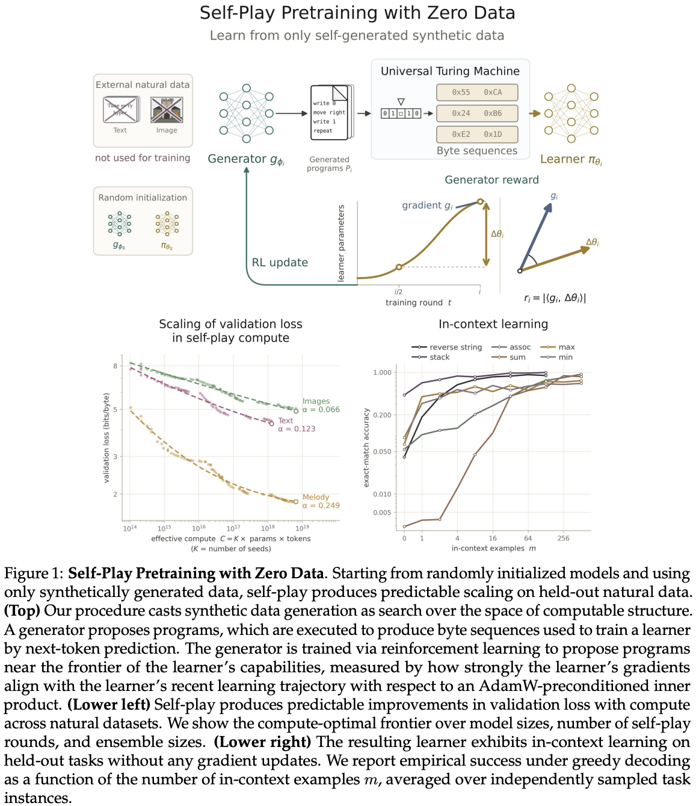

</img>

## Self-Play Pretraining with Zero Data

Implementation of [Self-Play Pretraining with Zero Data](https://arxiv.org/abs/2609.30063)

[Paper review by @hu-po](https://www.youtube.com/watch?v=mGMiiPpWBSo)

## Install

```bash
$ pip install self-play-pretrain-zero-data
```

## Usage

```python
import torch
from self_play_pretrain_zero_data import Brainfuck, SelfPlay, Transformer

executor = Brainfuck()

generator = Transformer(num_tokens = executor.num_tokens, dim = 512, depth = 6)
learner = Transformer(num_tokens = 256 + 1, dim = 512, depth = 6)

self_play = SelfPlay(generator, learner, executor)
self_play(epochs = 10)

torch.save(learner.state_dict(), './learner.pt')
```

## Program Pool

By default the learner trains on programs sampled from the current generator.

The paper (appendix G) mixes three program sources:

- `fresh` - sampled from the current generator
- `mutation` - an archived program with a small edit
- `replay` - an archived program, replayed as is

The archive holds the programs mutation and replay draw from. Passing one turns on all three sources with equal weights:

```python
from self_play_pretrain_zero_data import QualityDiversityArchive

archive = QualityDiversityArchive(executor = executor)

self_play = SelfPlay(
    generator,
    learner,
    executor,
    archive = archive,
    proposals = dict(fresh = 1., mutation = 1., replay = 1.)  # default when an archive is passed
)
```

Weights control the share of each source, e.g. `fresh = 2., mutation = 1., replay = 1.` draws twice as many fresh programs. A weight of 0 skips the source.

Custom sources are functions returning programs, wrapped with `self_play.program_batch`:

```python
import random

def uniform_programs(self_play, num_programs, **generation_kwargs):
    return self_play.program_batch([''.join(random.choice('><+-.,[]') for _ in range(8)) for _ in range(num_programs)])

self_play.proposals = {'fresh': 1., uniform_programs: 1.}
```

## Citations

```bibtex
@misc{cowsik2026selfplaypretrainingzerodata,
    title    = {Self-Play Pretraining with Zero Data},
    author   = {Aditya Cowsik and Kfir Dolev and Michael Y. Li and G. Bruno De Luca and Nourya Cohen and Noah D. Goodman and Yoav Levine},
    year     = {2026},
    eprint   = {2609.30063},
    archivePrefix = {arXiv},
    primaryClass = {cs.AI},
    url      = {https://arxiv.org/abs/2609.30063},
}
```

```bibtex
@software{Morehead_JVP_Flash_Attention_2025,
    author  = {Morehead, Alex},
    doi     = {10.5281/zenodo.17050188},
    license = {MIT},
    month   = {sep},
    title   = {JVP Flash Attention},
    url     = {https://github.com/amorehead/jvp_flash_attention},
    version = {0.14.0},
    year    = {2025}
}
```

```bibtex
@misc{bloem2025universalpretrainingiteratedrandom,
    title   = {Universal pre-training by iterated random computation},
    author  = {Peter Bloem},
    year    = {2025},
    eprint  = {2506.20057},
    archivePrefix = {arXiv},
    primaryClass = {cs.LG},
    url     = {https://arxiv.org/abs/2506.20057},
}
```

```bibtex
@misc{lee2026traininglanguagemodelsneural,
    title    = {Training Language Models via Neural Cellular Automata},
    author   = {Dan Lee and Seungwook Han and Akarsh Kumar and Pulkit Agrawal},
    year     = {2026},
    eprint   = {2603.10055},
    archivePrefix = {arXiv},
    primaryClass = {cs.LG},
    url      = {https://arxiv.org/abs/2603.10055},
}
```

## Replication script

Self-play discovers arithmetic, geometric and fibonacci programs from zero data, far above uniform sampling, with the dashboard opening automatically.

```bash
$ uv run experiments/replicate_table1.py
```
